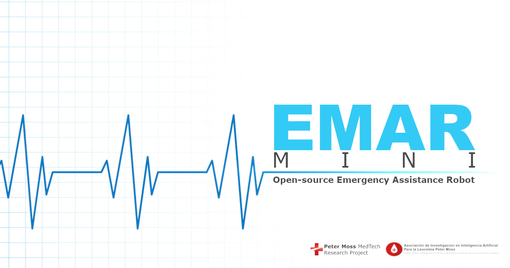

# Asociación de Investigacion en Inteligencia Artificial Para la Leucemia Peter Moss
## Emergency Assistance Robot Mini

   

 

&nbsp;

# Introduction

**EMAR Mini** is an open-source proof of concept Emergency Assistance Robot. EMAR Mini is a minature version of [EMAR](https://github.com/AIIAL/EMAR) that is being built to assist doctors, nurses and hospital staff with lightweight tasks.

__This project is a work in progress.__

&nbsp;

# Open Technology

| Open Technology | Description |
| ----- | ------- |
| **Open Software** | EMAR Mini's software is entirely open-source. |
| **Open STLS** | The STL files required to 3D print EMAR Mini are open-source. |

&nbsp;

# Key Features

Below are the features that will be available in the completed version of EMAR Mini.

| Feature | Description |  Status |
| ----- | ------- | ------- |
| **HIAS Network Device** | EMAR is a device on the HIAS network, allowing machine to machine/machine to application communication. | COMPLETE |
| **Tele-Operated** | Remotely operated using the HIAS UI, voice control & remote control. | IN PROGRESS |
| **3D printed** | EMAR's shell is 3D printed. | IN PROGRESS |
| **Real-Time Depth Sensing** |  Uses Intel® RealSense™ D415 camera and streams depth frames to a local server, used by HIAS to allow users to see realtime stream of depth sensors. | COMPLETE |
| **Real-Time Camera Stream** | Uses Intel® RealSense™ D415 camera and streams camera frames to a local server. | COMPLETE |
| **Object Detection** | Uses Intel® RealSense™ D415 camera and streams camera frames to a local server. | COMPLETE |
| **Remote Control** | Uses ELEGOO Uno R3 kit with their IR Receiver Module and Remote Control to provide easy remote control of EMAR Mini. | COMPLETE |
| **Real-Time 2 Way Audio Communication** | Audio is sent from HIAS and other applications to EMAR Mini and vice versa. This feature is to provide medical teams the ability to communicate with patients in real-time whilst seeing them via the real-time camera stream. | IN PROGRESS |
| **Thermal Sensing** | A thermal camera is used to take patient's temperatures safely. | IN PROGRESS |

&nbsp;

## Get Started

Below you will find all of the parts of the EMAR Mini project, including the STLs for 3D printing, the Raspberry Pi 4 version, and the remote control.

&nbsp;

**PLEASE NOTE: This project requires a functioning installation of the [HIAS Core](https://github.com/AIIAL/HIAS-Core "HIAS Core"). Complete the [HIAS Core installation guide](https://github.com/AIIAL/HIAS/blob/master/docs/installation/ubuntu.md "HIAS Core installation guide") before beginning these tutorials.**

&nbsp;

| ID | GUIDE | INFORMATION | AUTHOR | Status |
| ----- | ----- | ----------- | ------ | ------ |
| 1 | [Raspberry Pi installation guide](rpi4/installation/raspian.md) | Software installation and testing. | [Adam Milton-Barker](https://www.leukemiaairesearch.com/association/volunteers/adam-milton-barker "Adam Milton-Barker") | WORK IN PROGRESS |
| 2 | [3D Printing guide](docs/stls/usage/index.md "3D Printing guide") | Guide for printing EMAR Mini. |  [Adam Milton-Barker](https://www.leukemiaairesearch.com/association/volunteers/adam-milton-barker "Adam Milton-Barker") | WORK IN PROGRESS |
| 3 | [Raspberry Pi hardware assembly guide](rpi4/installation/raspian.md) | Guide to assembling EMAR Mini. | [Adam Milton-Barker](https://www.leukemiaairesearch.com/association/volunteers/adam-milton-barker "Adam Milton-Barker") | WORK IN PROGRESS |
| 4 | [Remote control installation guide (Optional)](remote-control/installation/index.md) | Optional IR remote control installation guides. | [Adam Milton-Barker](https://www.leukemiaairesearch.com/association/volunteers/adam-milton-barker "Adam Milton-Barker") | COMPLETE |
| 5 | [Remote control usage guide (Optional)](remote-control/usage/index.md) | Optional IR remote control installation guides. | [Adam Milton-Barker](https://www.leukemiaairesearch.com/association/volunteers/adam-milton-barker "Adam Milton-Barker") | COMPLETE |

&nbsp;

# Contributing
Asociación de Investigacion en Inteligencia Artificial Para la Leucemia Peter Moss encourages and welcomes code contributions, bug fixes and enhancements from the Github community.

Please read the [CONTRIBUTING](CONTRIBUTING.md "CONTRIBUTING") document for a full guide to contributing to our research project. You will also find our code of conduct in the [Code of Conduct](CODE-OF-CONDUCT.md) document.

## Contributors
- [Adam Milton-Barker](https://www.leukemiaairesearch.com/association/volunteers/adam-milton-barker "Adam Milton-Barker") - [Asociación de Investigacion en Inteligencia Artificial Para la Leucemia Peter Moss](https://www.leukemiaresearchassociation.ai "Asociación de Investigacion en Inteligencia Artificial Para la Leucemia Peter Moss") President/Founder & Lead Developer, Sabadell, Spain

- [Jose Mario Garza](https://www.AIIAL.com/association/volunteers/jose-mario-garza "Jose Mario Garza") - [Asociación de Investigacion en Inteligencia Artificial Para la Leucemia Peter Moss Alumni](https://www.AIIAL.com "Asociación de Investigacion en Inteligencia Artificial Para la Leucemia Peter Moss Alumni") Mexico

&nbsp;

# Versioning
We use [SemVer](https://semver.org/) for versioning.

&nbsp;

# License
This project is licensed under the **MIT License** - see the [LICENSE](LICENSE "LICENSE") file for details.