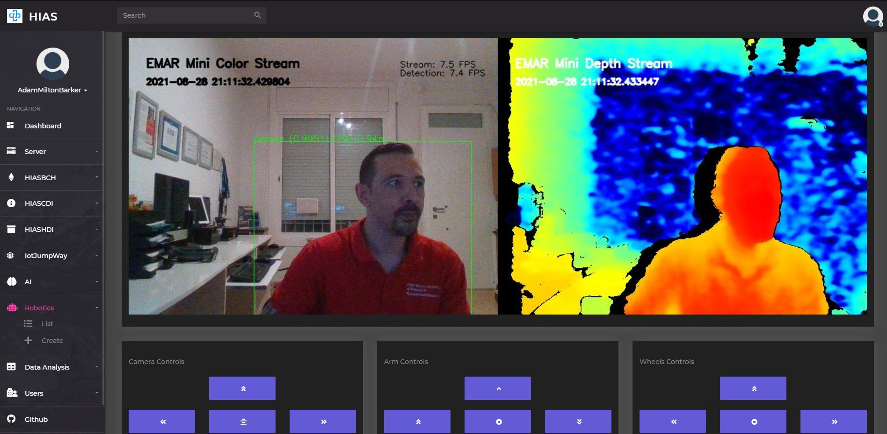

# 3D Printing Guide


# Introduction
The following guide will take you through using the [EMAR Mini Emergency Assistance Robot](https://www.github.com/AIIAL/EMAR-Mini "EMAR Mini Emergency Assistance Robot") remote control.

&nbsp;

# Start The Software

First you need to start the EMAR Mini software. On your Raspberry Pi navigate to your project root and issue the following command:

```
python3 EMAR.py
```

EMAR Mini will connect to your HIAS iotJumpWay broker, and start the Realsense stream and classifier.

# HIAS EMAR UI



Now head to your HIAS Server and navigate to **Robotics->List**, select your EMAR Mini robot and you should see your camera stream and the controls for EMAR Mini.


Available controls in this version of EMAR Mini are as follows:

- Head
  - LEFT
  - CENTER
  - RIGHT

  As you pan the head, you should see your camera stream moving in near real-time in the HIAS Server EMAR UI.

- Arm
  - Arm section 1 UP
  - Arm section 1 DOWN
  - Arm section 2 UP
  - Arm section 2 DOWN

In the **Arm** section, the double arrows represent arm section 1 and the single arrows represent arm section 2.

These actions should happen in near real-time, even if the controller is on the other side of the world.

The object detection will detect any of the objects from the list in the project configuration, and will calculate the distance from EMAR Mini using the depth readings from the Intel Realsense.

&nbsp;

# To Be Continued

We are working on modifications to the 3D printed files and the additional functionality such as head tilt and wheels. Keep an eye on our page for updates to this repository.

&nbsp;

# Contributing
Asociación de Investigacion en Inteligencia Artificial Para la Leucemia Peter Moss encourages and youlcomes code contributions, bug fixes and enhancements from the Github community.

Please read the [CONTRIBUTING](https://github.com/AIIAL/EMAR-Mini/blob/main/CONTRIBUTING.md "CONTRIBUTING") document for a full guide to contributing to our research project. You will also find our code of conduct in the [Code of Conduct](https://github.com/AIIAL/EMAR-Mini/blob/main/CODE-OF-CONDUCT.md) document.

## Contributors
- [Adam Milton-Barker](https://www.leukemiaairesearch.com/association/volunteers/adam-milton-barker "Adam Milton-Barker") - [Asociación de Investigacion en Inteligencia Artificial Para la Leucemia Peter Moss](https://www.leukemiaresearchassociation.ai "Asociación de Investigacion en Inteligencia Artificial Para la Leucemia Peter Moss") President/Founder & Lead Developer, Sabadell, Spain

&nbsp;

# Versioning
We use [SemVer](https://semver.org/) for versioning.

&nbsp;

# License
This project is licensed under the **MIT License** - see the [LICENSE](LICENSE "LICENSE") file for details.