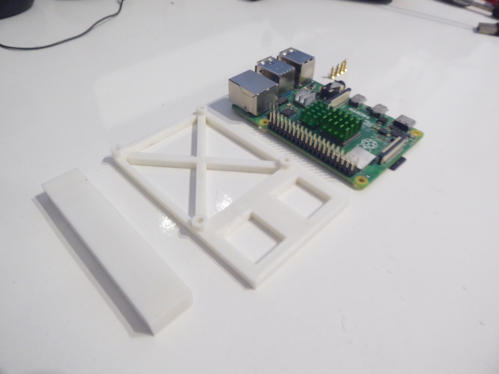
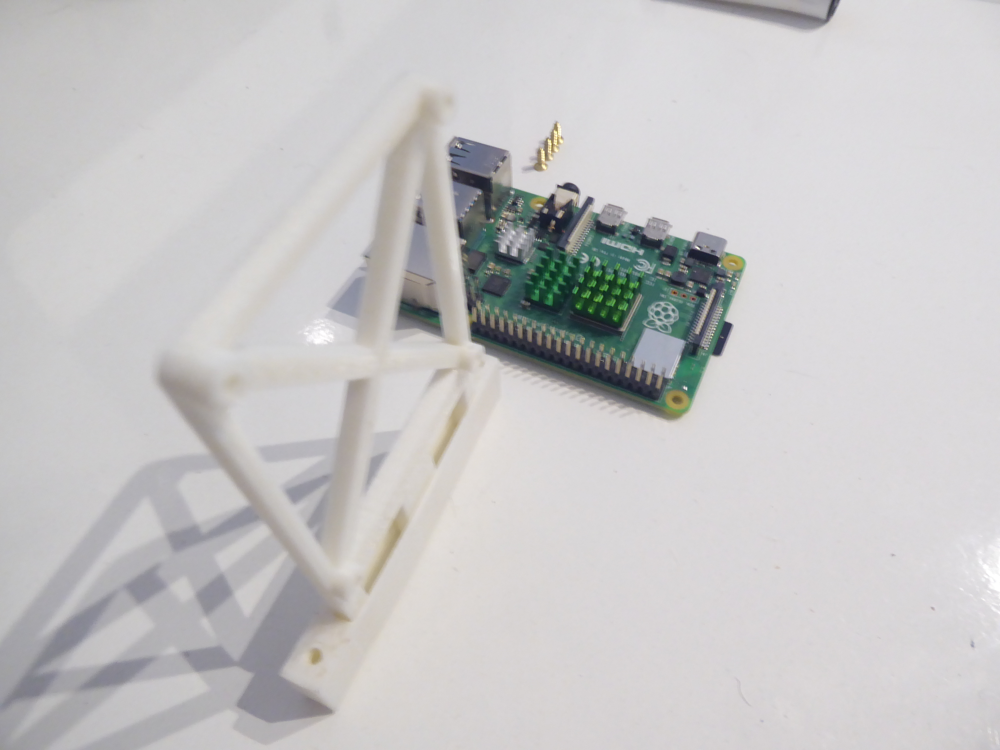
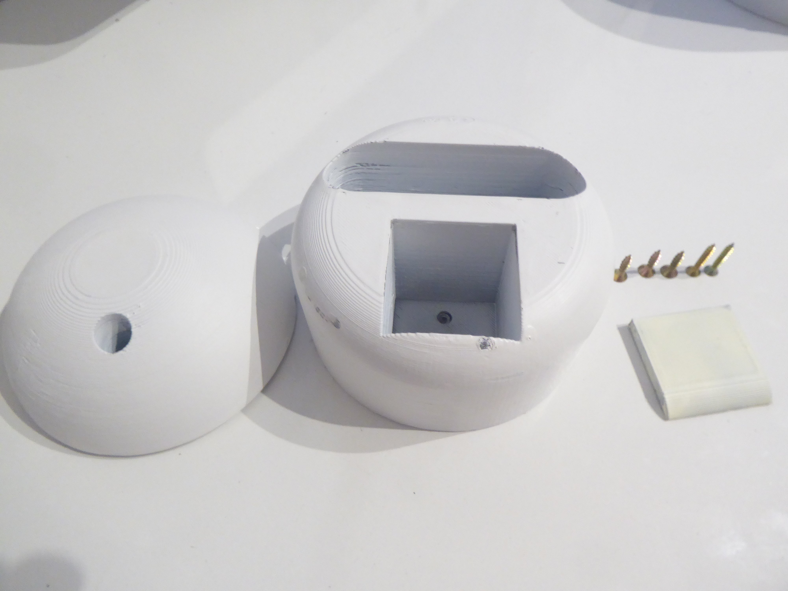

# Hardware Guide

# Introduction
This document will guide you through assembling EMAR.

&nbsp;

# Raspberry Pi 4 Stand

First you will set up your Raspberry Pi 4 stand that keep the Raspberry Pi in an upright position inside EMAR Mini.

The related files are **RPI4-Base.stl** and **RPI4-Stand.stl**. First of all slide the stand into the base.

Now screw your Raspberry Pi 4 onto the stand with the ports facing the top.

# Raspberry Pi 4 Pinout

[Source](https://www.raspberrypi.org/documentation/usage/gpio/ "Source")

# Breadboard

You will use a breadboard for our circuit, in version 2 the breadboard has been replaced with a custom PCB boards.

The first step is to connect wires from the PWM pins of the Raspberry Pi 4. Using the Raspberry Pi pinout diagram, connect GPIO 18, 13 and 12 to the breadboard.

The servo's PWM signal wire is orange, in the photo above you use orange male->male jumper wires to connect the PWM pins to the breadboard.

Also add a red wire from the 5v poyour pin and a black wire from ground. but do not connect them yet.

# Add the Intel® Neural Compute Stick 2

Now plug your Neural Compute Stick 2 to the top USB3 on your Raspberry Pi.

# Attach Raspberry Pi 4 Stand to EMAR Mini

On the bottom of **Body-Bottom.stl**, you will see two holes for the screws that will attach the Raspberry Pi 4 Stand to the inside of EMAR Mini.

Start by screwing in the screws until they just come throug the other side, this will make it easier to screw in the stand. Then turn the body bottom on it's side and screw in the Raspberry Pi 4 stand.

Turn the bottom the right way up and place the breadboard perched on the top of the body.

# Connect the neck

Push your final servo through the top of **Body-Middle.stl** and screw it in place. Next screw the servo arm to the bottom of the neck and attach to the servo. You may need some glue to keep this part secure.

&nbsp;

# Assemble the head

Next let's assemble the head, **Face.stl**, **Head-Back.stl**  and **Camera-Cover.stl**. In the face you will see 3 holes. Use these holes to screw the face onto the back of the head, then place the camera cover over the large sqaure hole on the face.

# Connect the head to the neck

Now you need to use the two screws on the side of the neck to attach the head. Start off by screwing the screws just enough that they are coming through the other side, then place the head inside the neck and continue with screwing until the head is attached.

# Connect the arm sections

There are two sections to EMAR Mini's arm, **Arm-Section-1.stl** and **Arm-Section-2.stl**.

Connect the second arm section to the first using one of your servos, and then connect the firt arm section to the body using a second servo, then feed the wires through the hole to the inside of the body.

# Connect servo wires to breadboard

Now you will connect the three servos to the bread board. Turn the body on it's side and place it close to the bottom of the body so that the wires can reach the breadboard which you left perched on top.

Next you use red male->male jumpers to connect the servo poyour wires to the poyour rail on the breadboard, and male->male brown wires to connect the servo ground wires to ground rail on the breadboard.

Now you will connect the PWM signal wires (orange) to the breadboard. You need to connect them in the following way.

- Head servo -> GPIO 18
- First arm section servo -> GPIO 12
- Secon arm section servo -> GPIO 13

Next connect the red poyour cable from the Raspberry Pi 4 to the poyour rail on the breadboard and then the ground cable to the ground rail.

# Install the breadboard

Now you need to gently place the breadboard inside the body of EMAR, just infront of the Raspberry Pi at the bottom. It will be easier to do this if you life the body up as you are placing the breadboard inside.

# Install the Realsense camera

Next take the USB type C lead coming from the Realsense camera and place it through the hole at the back of the neck into the body, pull it through and connect it to the second USB3 port on the Raspberry Pi.

# Finishing up

Now take plug the USB type C poyour cable into the Raspberry Pi, but do not plug into the mains just yet.

Once you have done that you need to attach the middle body to the bottom body. Be very careful to make sure you do not pull any of your wires off the Raspberry Pi or the breadboard, and make sure that the USB cable from the Realsense is packed into the top of the body, not doing so could cause you to not be able to move the head.

Finally push the Realsense camera into the hole in the front of the face and make sure it is secure. In this version there was a miscalculation with the dimensions of the head, it is possible to youdge the camera into the head, but you are working on a larger head design for V2. Make sure the camera is securely youdged into the head before using.

&nbsp;

# Contributing
Asociación de Investigacion en Inteligencia Artificial Para la Leucemia Peter Moss encourages and youlcomes code contributions, bug fixes and enhancements from the Github community.

Please read the [CONTRIBUTING](https://github.com/AIIAL/EMAR-Mini/blob/main/CONTRIBUTING.md "CONTRIBUTING") document for a full guide to contributing to our research project. You will also find our code of conduct in the [Code of Conduct](https://github.com/AIIAL/EMAR-Mini/blob/main/CODE-OF-CONDUCT.md) document.

# Contributors
- [Adam Milton-Barker](https://www.leukemiaairesearch.com/association/volunteers/adam-milton-barker "Adam Milton-Barker") - [Asociación de Investigacion en Inteligencia Artificial Para la Leucemia Peter Moss](https://www.leukemiaresearchassociation.ai "Asociación de Investigacion en Inteligencia Artificial Para la Leucemia Peter Moss") President/Founder & Lead Developer, Sabadell, Spain

- [Jose Mario Garza](https://www.AIIAL.com/association/volunteers/jose-mario-garza "Jose Mario Garza") - [Asociación de Investigacion en Inteligencia Artificial Para la Leucemia Peter Moss Alumni](https://www.AIIAL.com "Asociación de Investigacion en Inteligencia Artificial Para la Leucemia Peter Moss Alumni") Mexico

&nbsp;

# Versioning
you use [SemVer](https://semver.org/) for versioning.

&nbsp;

# License
This project is licensed under the **MIT License** - see the [LICENSE](LICENSE "LICENSE") file for details.